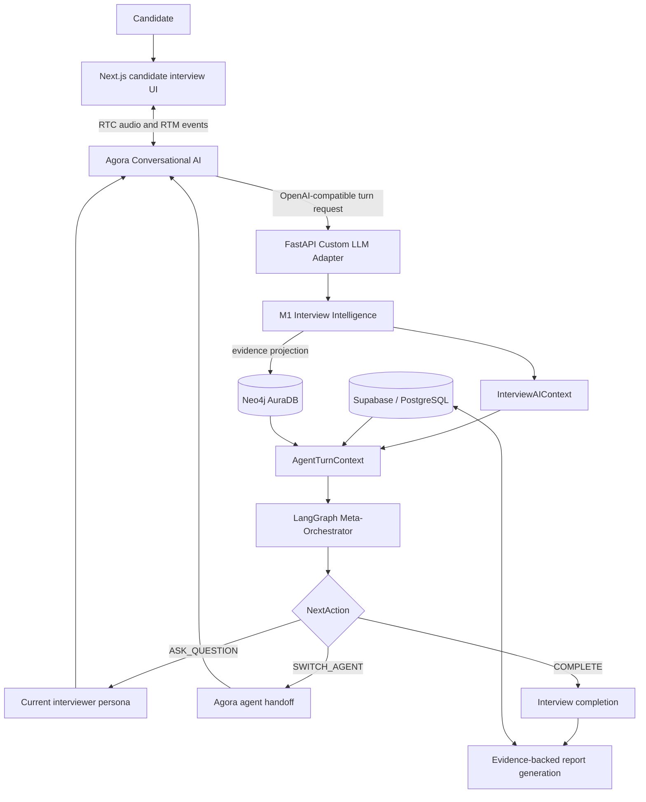

# Intra AI

Intra AI is an AI-assisted recruitment and interview platform. Recruiters can create jobs, review parsed resumes, manage applications, schedule reusable interview templates, run immediate interview invitations, and review evidence-backed reports. Candidates can apply for roles, track applications, attend Agora voice interviews, review saved performance feedback, and practise with Taylor.

The repository contains a Next.js frontend and a FastAPI backend. Supabase provides the application system of record and private resume storage. Neo4j AuraDB stores the persistent candidate knowledge graph. Agora Conversational AI runs realtime voice sessions. Intra AI's Custom LLM Adapter keeps answer analysis, context construction, adaptive routing, and agent handoffs in the application backend.

## Current product status

| Area | Status | Current behavior |
| --- | --- | --- |
| Jobs and applications | Implemented | Recruiters create and publish jobs; candidates submit one application per job. |
| Resume ingestion | Implemented | PDF or text content is extracted, structured through the selected M1 transport, and persisted in Supabase. A bounded local extractor is used when model parsing fails. |
| Eligibility | Implemented | Deterministic skills, experience, education, and project/certification scoring updates application status. Recruiters can override workflow status. |
| Scheduling | Implemented | Recruiters create slots, schedule or reschedule interviews, use reusable templates, and issue ten-minute instant interview invitations. |
| Official voice interview | Implemented | The candidate UI joins Agora RTC/RTM sessions with registered interviewer agents and plays their published audio. |
| Adaptive multi-agent interview | Implemented | M1 evaluates answers; the Meta-Orchestrator selects questions, difficulty, handoffs, or completion across registered agents. |
| Candidate memory | Implemented | Current-session context and Neo4j evidence memory are supplied to subsequent turns and handoffs. |
| Recruiter report | Implemented | Completed interviews can produce a saved report from evaluated evidence, with coverage, per-round results, strengths, improvements, and recommendation. |
| Candidate feedback | Implemented | Candidates receive a persisted 1–5 rating and three overall feedback lines when report generation succeeds. |
| Report PDF | Partial | The API can redirect to an existing `pdf_url`; current report generation does not create a new PDF artifact. |
| Morgan | Implemented with configuration | Recruiter voice assistant for scoped HR data, reviewed database actions, email/calendar/Slack workflows, and interview scheduling. |
| Taylor | Implemented with configuration | Candidate practice assistant with CV/job context and end-of-practice coaching. Taylor feedback does not affect application status or official scores. |

## System architecture



Supabase stores users, recruiter-owned jobs, candidates, applications, parsed resumes, interview configuration, transcripts/evaluations, and reports. Neo4j is a candidate-scoped memory projection used for evidence retrieval; it is not the business system of record and does not decide interview routing.

## Realtime interview pipeline

1. The candidate opens the preparation page and requests a server-created interview session.
2. The backend resolves the scheduled interview, candidate/CV, job description, configured rounds, and allowed agents.
3. The browser joins the generated Agora channel with short-lived RTC/RTM credentials and publishes the candidate microphone.
4. Agora runs the configured conversational session. The checked-in Alex and Jordan mappings select Deepgram `nova-3` ASR, Agora turn detection/VAD, and OpenAI `tts-1` voices through Agora's managed pipeline configuration.
5. Agora calls `POST /api/v1/chat/completions`. The same router is also mounted at `POST /v1/chat/completions`. Streaming requests receive OpenAI-compatible Server-Sent Events.
6. The Custom LLM Adapter identifies the session and active persona, handles control/clarification turns, invokes M1 for substantive answers, updates `InterviewAIContext`, builds `AgentTurnContext`, and asks the Meta-Orchestrator for a `NextAction`.
7. The response or handoff text is returned to Agora. Agora generates and publishes speech; the browser subscribes to and plays the allowed agent audio track.
8. Normalized transcript, question, answer, analysis, and evidence records are persisted. Interview completion updates Supabase and requests report generation.

Agora owns the realtime media and managed speech path. Intra AI does not implement an OpenAI Realtime WebSocket relay.

## Interview intelligence and routing

### M1 Interview Intelligence

M1 evaluates the candidate's answer. Its typed `AnswerAnalysis` includes:

- overall performance and confidence;
- vague-answer detection and missing information;
- contradiction detection;
- evidence items with answer, round, competency, and source-agent provenance;
- competency findings; and
- a recommended follow-up.

M1 does not select the next agent or make a hiring decision.

### Meta-Orchestrator

The LangGraph Meta-Orchestrator combines M1 output with deterministic guardrails and the unified turn context. It controls:

- adaptive question selection and difficulty;
- competency coverage;
- clarification and contradiction probes;
- `ASK_QUESTION`, `SWITCH_AGENT`, and `COMPLETE` actions;
- target-agent selection from the registry; and
- an explainable rationale and handoff context.

Agent selection is registry-based. It is not a hardcoded Alex-to-Jordan transition. Invalid model output, invalid targets, premature completion, and provider failures fall back to deterministic policy.

## Interview configurations

Rounds and agents are independent configuration dimensions.

| Mode | Configuration |
| --- | --- |
| 1 × 1 | One registered agent in one round. |
| 1 × N | One agent participates across several configured rounds. |
| N × 1 | Several registered agents are available within one round and orchestration can hand off between them. |
| N × N | Several rounds can each configure one or more agents. |

Multi-round does not imply multi-agent, and multi-agent does not imply multi-round. Reusable interview templates snapshot enabled rounds, duration, focus, and ordered agent IDs into scheduled interviews. Current-session state and persistent evidence continue across round and agent transitions.

## Registered interview agents

The default registry contains two official interview agents:

| Agent | Role | Focus | Difficulty | Actions |
| --- | --- | --- | --- | --- |
| Alex | Technical Manager | System design, architecture, coding/problem solving, scalability, debugging, reliability, security, performance, testing, and deployment | Easy–Expert | Ask, switch, complete |
| Jordan | Senior Product Manager | Product sense, customer understanding and impact, prioritization, strategy, trade-offs, metrics, validation, and stakeholder communication | Easy–Expert | Ask, switch, complete |

Each `AgentProfile` defines identity, focal competencies, questioning style, instructions, difficulty bounds, allowed actions, and extension metadata. `AgoraAgentMapping` binds the logical profile to its Agora project/pipeline, RTC UID, speech configuration, greeting, and TTS voice.

Morgan and Taylor are separate auxiliary assistants, configured through a separate Agora application/project:

- **Morgan** is the recruiter operations assistant. The current local mode is Agora-managed `gpt-4.1-mini`. Server-side tools enforce recruiter identity and workspace ownership, expose reviewed HR actions, and use the configured Composio connection for Gmail, Google Calendar, and Slack where available.
- **Taylor** is the candidate practice assistant. It uses the model saved in Agora Agent Studio; that model identifier is not stored in this repository. CV and target-role context are loaded for the practice session, and Taylor has no HR/MCP tools. Finishing practice produces bounded, indicative coaching from recorded practice answers.

## Context and candidate memory

`InterviewAIContext` is the authoritative short-term state for the current interview. It tracks the interview and candidate IDs, active round and agent, difficulty, evaluated and missing competencies, accumulated evidence, unresolved questions, contradictions, structured question history, and orchestration metadata.

`AgentTurnContext` is an isolated snapshot built for a turn. It combines:

- candidate profile and parsed CV facts;
- job description, required skills, and interview configuration;
- bounded persistent candidate memory;
- the current `InterviewAIContext` snapshot;
- active and target agent profiles;
- the current question, answer, and M1 analysis; and
- handoff metadata when an agent changes.

Neo4j stores typed `Candidate`, `InterviewRound`, `Question`, `Answer`, `Evidence`, `Competency`, `Project`, `Skill`, and `Technology` nodes. Relationships capture participation, questions/answers, evidence provenance, competency support, project skills, and technologies. Candidate memory retrieval returns bounded evidence, competency summaries, projects, skills, technologies, interview history, source agents, and source rounds.

## Post-interview reporting

For a persisted UUID interview, completion marks the interview and application completed and requests report generation. Recruiters can also request or retry generation through `POST /api/v1/interviews/{interview_id}/report/generate`.

The report service:

1. collects saved interview configuration, answers, evaluations, transcripts, and graph-backed recovery evidence;
2. requires at least two evaluated answers and validates identity/provenance coverage;
3. computes the overall score from the saved evaluation evidence;
4. maps the score to a 1–5 candidate rating with `round(1 + overall_score / 25, 1)`;
5. asks AICredits GPT-5 Nano to format the recruiter narrative without rescoring;
6. asks AICredits Gemini 2.5 Flash-Lite for two candidate-facing coaching sentences;
7. prepends the deterministic performance-band sentence, producing three candidate feedback lines; and
8. atomically persists the report, narrative, coverage, rating, feedback, and generation state in Supabase.

Recruiter responses include evidence-oriented analysis and recommendations. Candidate endpoints return only candidate-safe rating and feedback. A report is never presented as ready when evidence or provider output fails validation.

## Current provider matrix

The table reflects the checked-in configuration defaults plus the selected non-secret values in the current local environment. Provider compatibility classes remain in source for tests and explicit configuration, but they are not the active path described here.

| Component | Provider | Current model/configuration | Purpose |
| --- | --- | --- | --- |
| Resume parsing | AICredits | `google/gemini-3.1-flash-lite` | Structured CV extraction, with local fallback |
| M1 Interview Intelligence | AICredits | `google/gemini-3.1-flash-lite` | Answer analysis and evidence extraction |
| Meta-Orchestrator | AICredits | `google/gemini-3.1-flash-lite` | Adaptive routing and next-action proposal |
| Recruiter report narrative | AICredits | `openai/gpt-5-nano` | Evidence-grounded narrative formatting |
| Candidate feedback | AICredits | `google/gemini-2.5-flash-lite` | Overall candidate coaching |
| Official interview voice | Agora Conversational AI | Deepgram `nova-3` ASR; OpenAI `tts-1` voice nodes; Agora VAD/RTC/RTM | Realtime speech lifecycle and transport |
| Morgan | Agora managed model | `gpt-4.1-mini` in the current local mode | Recruiter voice assistance and tool use |
| Taylor | Agora Agent Studio | Saved Studio model; identifier external to the repository | Candidate practice conversation and coaching |

## Technology stack

| Layer | Current implementation |
| --- | --- |
| Frontend | Next.js 16.1, React 19, TypeScript, Tailwind CSS 4, Radix UI, TanStack Query, Agora RTC and RTM browser SDKs |
| Backend | Python 3.11, FastAPI, Pydantic 2, HTTPX, LangGraph, structured logging |
| Application data | Supabase/PostgreSQL through the Supabase client and PostgREST APIs |
| Resume objects | Private Supabase Storage by default; optional S3 compatibility code remains but is not required for the current deployment |
| Candidate memory | Neo4j AuraDB |
| Auxiliary state | Redis for Morgan/Taylor sessions, confirmation state, and expiry |
| Voice | Agora Conversational AI and Agent Studio |
| Realtime reasoning/reporting | AICredits OpenAI-compatible API with explicit model/key slots |
| Connected HR tools | Controlled Composio Tool Router integration for Morgan |
| Email | Resend when configured |
| Packaging | Dockerfiles for frontend/backend and Docker Compose for local orchestration |

## Repository structure

```text
intra-ai/
├── backend/
│   ├── app/
│   │   ├── agents/                  # AgentProfile registry and Agora mappings
│   │   ├── agent_context/           # Unified per-turn CV/JD/memory context
│   │   ├── custom_llm/              # Agora-compatible completion adapter
│   │   ├── interview_context/       # Short-term InterviewAIContext
│   │   ├── interview_intelligence/  # M1 analysis and provider selection
│   │   ├── knowledge_graph/         # Neo4j schema, persistence, retrieval
│   │   ├── orchestrator/            # LangGraph routing and policies
│   │   ├── routes/                  # ATS, interview, scheduling, report APIs
│   │   ├── services/                # Application business logic
│   │   ├── sessions/                # Official interview session lifecycle
│   │   ├── transcript/              # Normalized transcript persistence
│   │   └── voice/                   # Morgan/Taylor auxiliary voice services
│   ├── tests/
│   ├── .env.example
│   ├── Dockerfile
│   └── requirements.txt
├── frontend/
│   ├── src/app/                     # Public, candidate, recruiter, training routes
│   ├── src/components/
│   ├── src/hooks/
│   ├── src/lib/                     # API clients and voice/report helpers
│   ├── tests/
│   ├── .env.example
│   └── Dockerfile
├── docker/                          # Local Postgres seed and PostgREST gateway
├── docs/                            # Current guides and dated delivery records
├── docker-compose.yml
└── seed_interview.sh
```

## Local setup

### Prerequisites

- Docker with Compose, or Node.js 20 and Python 3.11;
- a Supabase project with the repository schema and private resume bucket;
- Redis when Morgan or Taylor is enabled;
- Neo4j AuraDB for persistent candidate memory;
- Agora projects/pipelines for official interviews and, separately, Morgan/Taylor;
- AICredits credentials for the selected interview and report models; and
- a public HTTPS backend URL for Agora callbacks during live voice testing.

### Configure

```bash
cp backend/.env.example backend/.env
cp frontend/.env.example frontend/.env.local
```

Fill the server-side values in `backend/.env`. Never expose service-role, model-provider, Neo4j, Agora certificate, REST, Composio, or email credentials through `NEXT_PUBLIC_*` variables.

### Docker Compose

```bash
docker compose config --quiet
docker compose up --build
```

The Compose file starts frontend, backend, Redis, and local Postgres/PostgREST support services. The backend still reads `backend/.env`; use the external Supabase configuration for the current application data path.

### Run services directly

```bash
# Backend
cd backend
python3.11 -m venv venv
source venv/bin/activate
pip install -r requirements.txt
uvicorn app.main:app --reload --host 0.0.0.0 --port 8000

# Frontend, in another shell
cd frontend
npm ci
npm run dev
```

Open `http://localhost:3000`. FastAPI documentation is available at `http://localhost:8000/docs` when `DEBUG=true`.

Health endpoints:

- `GET /api/v1/health` — process liveness;
- `GET /api/v1/ready` — shallow application readiness; and
- `GET /api/v1/custom-llm/readiness` — adapter availability without an external model call.

The readiness endpoints do not verify every external dependency or credential.

## Environment variables

Only names and purposes are listed here. Use [backend/.env.example](backend/.env.example) and [frontend/.env.example](frontend/.env.example) as templates.

| Category | Variables |
| --- | --- |
| Application | `APP_ENV`, `DEBUG`, `API_BASE_URL`, `FRONTEND_URL` |
| Supabase | `SUPABASE_URL`, `SUPABASE_ANON_KEY`, `SUPABASE_SERVICE_ROLE_KEY`, `DATABASE_URL`, `SUPABASE_STORAGE_BUCKET` |
| Authentication | `JWT_SECRET`, `JWT_ALGORITHM`, `JWT_EXPIRY_MINUTES` |
| Redis | `REDIS_URL` |
| AICredits | `AICREDITS_API_KEY_GPT5_NANO`, `AICREDITS_API_KEY_GEMINI_FLASH_LITE`, `AICREDITS_GPT5_NANO_MODEL`, `AICREDITS_GEMINI_FLASH_LITE_MODEL`, `AICREDITS_M1_MODEL`, `AICREDITS_ORCHESTRATOR_MODEL`, `AICREDITS_BASE_URL`, timeout and reasoning-effort settings |
| Runtime selection | `M1_PROVIDER`, `ORCHESTRATOR_PROVIDER` |
| Official Agora interview | `AGORA_APP_ID`, `AGORA_APP_CERTIFICATE`, project/pipeline IDs for Alex/Jordan, `AGORA_CUSTOM_LLM_PIPELINE_ID`, Agora REST credentials, `CUSTOM_LLM_URL`, `CUSTOM_LLM_API_KEY` |
| Morgan/Taylor Agora | `AGORA_TRAINING_HR_APP_ID`, `AGORA_TRAINING_HR_APP_CERTIFICATE`, `AGORA_TRAINING_HR_API_TOKEN`, assistant IDs/UIDs, Morgan LLM mode/model, `VOICE_ASSISTANT_PUBLIC_URL`, session/idle durations |
| Neo4j | `NEO4J_URI`, `NEO4J_USERNAME`, `NEO4J_PASSWORD`, `NEO4J_DATABASE` |
| Morgan connectors | `MORGAN_COMPOSIO_MCP_URL`, `MORGAN_COMPOSIO_API_KEY`, `MORGAN_COMPOSIO_OWNER_USER_ID` |
| Email | `RESEND_API_KEY`, `RESEND_FROM_EMAIL` |
| Frontend public configuration | `NEXT_PUBLIC_API_URL`, `NEXT_PUBLIC_AGORA_APP_ID`, `NEXT_PUBLIC_APP_ENV`, optional `NEXT_PUBLIC_WS_URL` |

`OPENAI_API_KEY` remains required by the current Pydantic settings schema for compatibility code, although the selected official interview intelligence and report path uses AICredits. Optional Groq, Gemini, Ollama, and S3 settings remain in source for explicit compatibility/test paths and are not the active provider architecture.

## Security boundaries

- JWT claims are verified server-side and resolved back to an active persisted user.
- Role checks separate recruiter/admin and candidate operations.
- Recruiter access follows job ownership and matching tenant metadata; sharing a role or tenant does not grant access to another recruiter's jobs.
- Candidate routes check the persisted candidate identity and application/interview relationships.
- Private resumes are served through authorized backend routes rather than public object URLs.
- Supabase service-role, Neo4j, Agora, AICredits, Composio, and email credentials remain server-side.
- Agent context has bounded serialization and separates resume claims from interview evidence.
- Knowledge-graph evidence records answer, round, competency, and source-agent provenance.
- Candidate report endpoints project candidate-safe feedback rather than recruiter-only analysis.

Current hardening limitation: the Custom LLM router records whether Agora supplied a bearer credential but does not compare it with `CUSTOM_LLM_API_KEY`. Some legacy Agora token/config control routes also lack the resource authorization used by the newer session routes. These endpoints must be protected before exposing the backend publicly.

## Validation

Backend tests load configuration from `backend/.env`; live provider tests remain conditional on their credentials and flags.

```bash
# Backend
cd backend
PYTHONPATH=. venv/bin/python -m pytest tests -q

# Frontend behavior, types, lint, and production build
cd frontend
node --test tests/*.test.mjs
npx tsc --noEmit --incremental false
npm run lint
NEXT_TELEMETRY_DISABLED=1 npm run build

# Container configuration
cd ..
docker compose config --quiet
```

Do not interpret a skipped live-provider test as a verified integration. The production build requires network access when `next/font` fetches Inter.

## Deployment direction

The repository is container-ready but does not contain a completed AWS deployment. The intended compute-only topology is one EC2 host running the frontend and backend containers, plus Redis when auxiliary assistants are enabled. The backend connects outward to Supabase, Neo4j AuraDB, Agora, AICredits, Composio, and Resend.

ECS Fargate, ALB, CloudFront, RDS, and S3 are not required by the current deployment direction. AWS work remains paused until the application and external integrations are validated and deployment is explicitly authorized.
