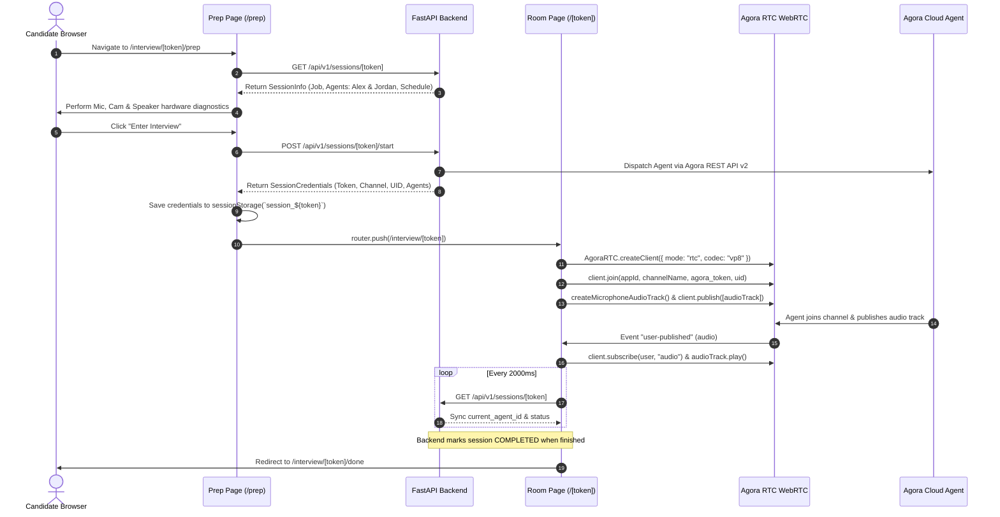
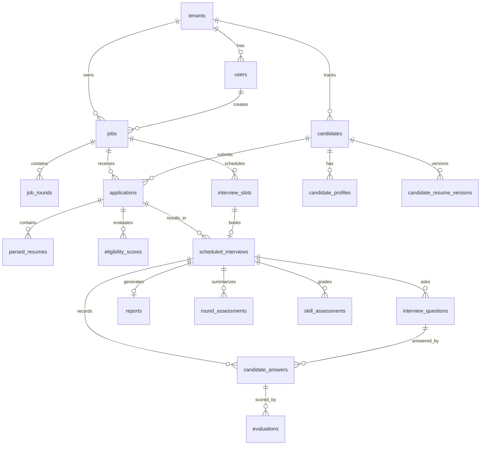
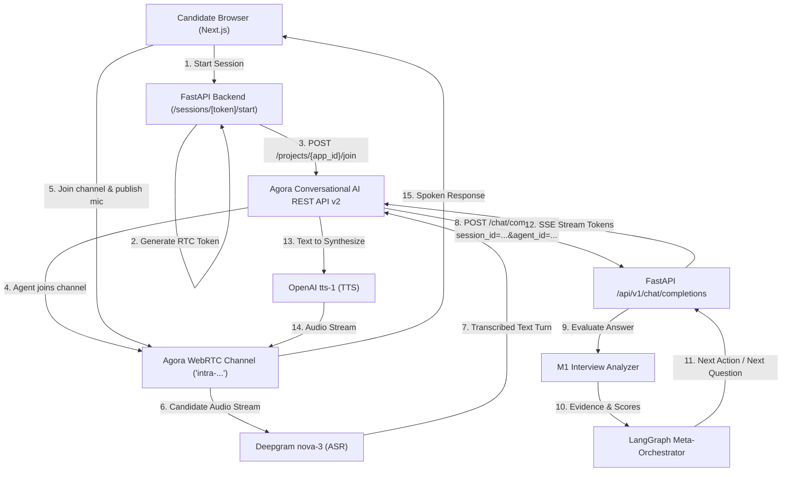
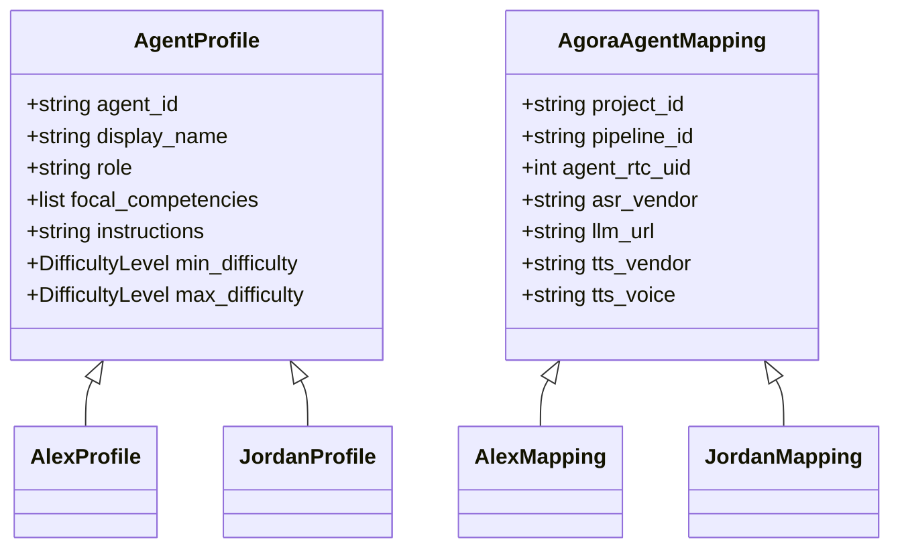
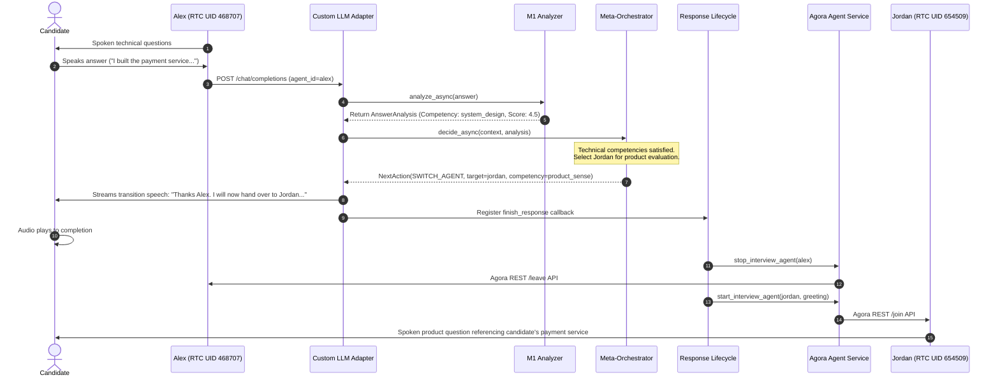
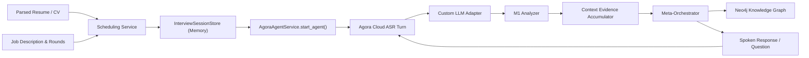
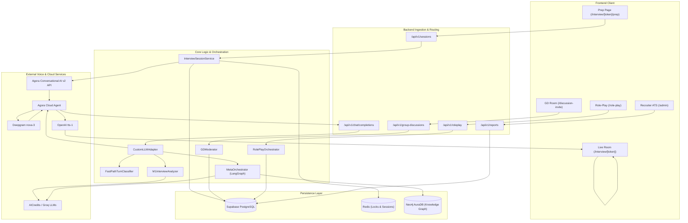

# INTRA AI V3 — FULL CODEBASE FORENSIC ANALYSIS

> **Document Version:** 1.0.0-V3-FORENSIC  
> **Repository:** Intra AI (`intra-ai-2`)  
> **Target Branch:** `v3-analysis` (Base: `v3` @ `84fd857`)  
> **Nature of Task:** READ-ONLY Forensic Codebase Analysis (Zero application code or configuration modified)  
> **Source of Truth:** Repository code, database migrations, and API implementations.

---

## 1. EXECUTIVE SUMMARY

The Intra AI V3 platform is an AI-native talent evaluation and autonomous interview orchestration platform. A forensic audit of the codebase reveals that the architecture is divided into three distinct functional layers:

1. **The Standard Voice Interview System (Production / Core Domain):**
   * **Interviewer Personas:** Two primary multi-turn agents—**Alex** (Senior Technical Manager) and **Jordan** (Senior Product Manager).
   * **Voice & Media Engine:** Cloud-dispatched WebRTC voice via **Agora Conversational AI Engine v2 (Agent Studio)** utilizing **Deepgram nova-3** (ASR) and **OpenAI tts-1** (TTS).
   * **Cognitive Reasoning Loop:** Agora does *not* run a native LLM. Instead, Agora dispatches text transcripts via HTTP POST to an OpenAI-compatible **Custom LLM Adapter** (`/api/v1/chat/completions`) exposed by the FastAPI backend.
   * **Intelligence & Orchestration:** The Custom LLM adapter routes candidate answers through **M1 Interview Intelligence** (semantic rubric evaluation) and a **Meta-Orchestrator** built on **LangGraph StateGraph** (adaptive difficulty adjustment, topic transitions, and persona handoffs).
   * **Candidate Memory:** Real-time evaluation findings are asynchronously projected into a **Neo4j AuraDB Knowledge Graph**.
   * **Candidate Experience:** Next.js 16.1 (React 19) WebRTC client (`agora-rtc-sdk-ng`) with pre-interview hardware diagnostic lobby (`/interview/[token]/prep`) and live room (`/interview/[token]`).

2. **Auxiliary Voice Assistants (Secondary Domain — Training & Recruiter Copilot):**
   * **Taylor:** Practice interviewer for candidates to simulate interviews prior to official evaluation.
   * **Morgan:** Recruiter voice copilot equipped with an **MCP (Model Context Protocol)** tool router and **Composio** integrations to inspect candidates, draft jobs, and trigger platform workflows.
   * **Infrastructure:** Hosted in a separate, isolated Agora Studio project (`AGORA_TRAINING_HR_APP_ID`) managed by `VoiceAssistantService`.

3. **Advanced Assessment Pilots (Group Discussion & Role-Play):**
   * **Group Discussion (GD):** Multi-participant collaborative text discussion with automated moderator intervention, deterministic signal extraction, and PostgreSQL-enforced turn/lease concurrency.
   * **Role-Play:** Multi-phase simulation with dynamic escalation levels (0–5), resistance stances, objection handling, and competency evidence generation.
   * **Architectural Reality:** **Both GD and Role-Play are currently text-based assessment pilots.** They use `LocalTextSessionAdapter` and PostgreSQL stored procedures. Neither feature is connected to Agora RTC/RTM audio channels.

---

## 2. REPOSITORY MAP

```text
intra-ai-2/
├── backend/                               # FastAPI Python backend service
│   ├── app/
│   │   ├── agent_context/                 # Real-time CV & job context builder for agent turns
│   │   ├── agents/                        # Interviewer persona definitions (Alex, Jordan, registry)
│   │   ├── candidate_onboarding/          # Candidate resume upload & versioned parsing
│   │   ├── company_knowledge/             # Company policy document repository & RAG retrieval
│   │   ├── core/                          # Config, security, exceptions, middleware, Agora token builder
│   │   ├── custom_llm/                    # OpenAI-compatible Custom LLM callback adapter for Agora
│   │   ├── feature_runtime/               # System readiness probe and worker health
│   │   ├── group_discussion/              # Group discussion session, moderation, and event service
│   │   ├── integrations/                  # External clients (AICredits, Groq, OpenAI, S3, Resend)
│   │   ├── intelligence/                  # Domain-specific intelligence engines (GD, Role-Play, Company)
│   │   ├── interview_context/             # In-memory interview AI context store & models
│   │   ├── interview_intelligence/        # M1 Interview Intelligence analyzer and LLM providers
│   │   ├── knowledge_graph/               # Neo4j Knowledge Graph persistence and candidate memory
│   │   ├── main.py                        # FastAPI application entry point, lifecycle & router mounting
│   │   ├── models/                        # Global enumeration definitions
│   │   ├── orchestrator/                  # LangGraph Meta-Orchestrator and adaptive questioning policies
│   │   ├── repositories/                  # Supabase/Postgres data access layer (Jobs, Applications, etc.)
│   │   ├── role_play/                     # Role-play scenario orchestrator and session management
│   │   ├── routes/                        # HTTP REST API routers (Jobs, Candidates, Sessions, etc.)
│   │   ├── schemas/                       # Pydantic request/response validation schemas
│   │   ├── services/                      # Application business logic (Scheduling, Evaluation, Agora agent)
│   │   ├── sessions/                      # Live interview meeting sessions and lifecycle management
│   │   └── voice/                         # Auxiliary voice assistant service (Morgan, Taylor, MCP tools)
│   ├── migrations/                        # SQL migration scripts (8 incremental migrations)
│   ├── requirements.txt                   # Production Python dependencies
│   └── tests/                             # 80 backend test suites + 13 feature test suites
├── frontend/                              # Next.js 16.1 App Router frontend
│   ├── src/
│   │   ├── app/
│   │   │   ├── (auth)/                    # Sign-in and Sign-up routes
│   │   │   ├── (candidate)/               # Candidate portal, training, prep, and live interview room
│   │   │   ├── (public)/                  # Public career pages and job listings
│   │   │   ├── admin/                     # Recruiter ATS dashboard, jobs, reports, GD, role-play
│   │   │   ├── discussion-invite/         # Public GD candidate invitation landing page
│   │   │   └── test-launcher/             # Developer utility to instantiate test interview sessions
│   │   ├── components/                    # Reusable UI component library (Radix UI, Tailwind CSS)
│   │   ├── features/                      # Isolated feature UI modules (GD, Role-Play, Onboarding, Policies)
│   │   ├── hooks/                         # React hooks (useVoiceAssistant, useKeyboardShortcuts)
│   │   ├── lib/                           # API clients, Agora audio lifecycle, auth utilities
│   │   └── middleware.ts                  # Edge cookie authentication & RBAC route guard
│   ├── package.json                       # Next 16.1.6, React 19.2.3, Tailwind 4, Agora WebRTC SDK
│   └── tests/                             # 10 frontend unit & contract test suites (.test.mjs)
├── docker/
│   ├── init-db/01-init.sql                # Base PostgreSQL schema, tables, roles, and initial seed data
│   ├── docker-compose.yml                 # Local development stack (Supabase/Postgres, Redis)
│   └── docker-compose.production.yml      # Production stack definition
└── objective.md                           # Project technical specifications and architectural guidelines
```

---

## 3. FRONTEND ARCHITECTURE

### 3.1 Technology Stack
* **Framework:** Next.js `16.1.6` (App Router) running on React `19.2.3`.
* **Styling & Components:** Tailwind CSS `v4`, Radix UI primitives (`@radix-ui/react-*`), Lucide icons, Framer Motion `12.4.7`.
* **Data Fetching & State:** `@tanstack/react-query` `5.102.8`, browser `sessionStorage`, Native `fetch` with custom error envelopes (`standard-interview-fetch.ts`).
* **Realtime Audio & Media:** `agora-rtc-sdk-ng` `4.24.8` (WebRTC client engine), `agora-rtm-sdk` `2.2.0`.

### 3.2 Routing Structure & Route Guards
* `src/middleware.ts`: Inspects `intra_auth_token` and `intra_user_role` cookies.
  * `/admin/*`: Restricted to `admin` and `recruiter` roles; unauthenticated users redirected to `/login?from=...`; unauthorized candidates redirected to `/portal`.
  * `/portal/*`: Restricted to `candidate` role; recruiters redirected to `/admin/dashboard`.
  * `/login`, `/signup`: Authenticated users automatically bounced to their respective dashboards.
  * `/interview/[token]/*`: Publicly accessible via opaque interview token; requires no JWT session cookie.

### 3.3 Candidate Interview Lifecycle Trace



1. **Hardware Verification (`prep/page.tsx`):** Validates microphone input level via Web Audio API, camera preview via `navigator.mediaDevices.getUserMedia`, and speaker audio playback.
2. **Session Initialization (`prep/page.tsx:L120-L150`):** Calls `POST /api/v1/sessions/${token}/start`.
3. **Channel Join (`[token]/page.tsx:L306-L350`):** Dynamically imports `agora-rtc-sdk-ng` on the client. Joins channel `intra-{interview_id}` with candidate UID `0`.
4. **Local Audio Stream (`[token]/page.tsx:L400-L450`):** Creates microphone track and publishes to RTC channel.
5. **Remote Agent Subscription (`[token]/page.tsx:L360-L395`):** Idempotently subscribes to remote agent tracks using `createIdempotentAudioPlayer()` in `agora-audio-lifecycle.ts`.
6. **Active Speaker Visualization (`[token]/page.tsx:L460-L510`):** Listens to `client.on("volume-indicator")`. Differentiates candidate speaking from AI agent speaking based on remote user UIDs.
7. **Polling Synchronization (`[token]/page.tsx:L250-L290`):** Polls `GET /api/v1/sessions/${token}` every 2 seconds to synchronize persona handoffs (`current_agent_id`) and completion status without relying on volatile RTM messages.

---

## 4. BACKEND ARCHITECTURE

### 4.1 Technology Stack
* **Framework:** FastAPI `0.115.6`, Uvicorn `0.34.0`.
* **Database & Persistence:** Supabase Python SDK `2.13.0` (PostgREST client), Redis `5.2.1` (`redis.asyncio`), Neo4j `5.20.0`.
* **AI & Graph Frameworks:** LangGraph `>=0.2.0,<1.0.0`, LangChain Core, OpenAI `1.58.1`, HTTPX `0.28.1`.
* **Telemetry & Logging:** Structlog `24.4.0` (structured JSON in production, console in development).

### 4.2 Application Initialization & Middleware (`app/main.py`)
* `lifespan`: Initializes Supabase client, Redis connection pool, persistent Groq and AICredits HTTP connection pools, and optional auxiliary voice assistant service (`VoiceAssistantService`).
* **Middleware Pipeline (outer to inner):**
  1. `RequestLoggingMiddleware`: Attaches timing and request metadata.
  2. `RequestIDMiddleware`: Injects unique `X-Request-ID`.
  3. `CORSMiddleware`: Restricts origins to `FRONTEND_URL` and `localhost:3000`.
  4. `CustomLLMCredentialBoundary`: Validates `Authorization: Bearer <CUSTOM_LLM_API_KEY>` on `/v1/chat/completions` and `/api/v1/chat/completions`.
  5. `StandardHTTPBoundary`: Enforces timeout, content-length, and rate-limit guardrails.

### 4.3 Request Flow: API Route to Database
```text
Client Request
      ↓
FastAPI Router (e.g. app/routes/jobs.py)
      ↓
Authentication / RBAC Dependency (app/core/deps.py -> app/voice/authorization.py)
      ↓
Business Service Layer (e.g. app/services/job_service.py)
      ↓
Repository Layer (e.g. app/repositories/job_repo.py)
      ↓
Supabase PostgREST / PostgreSQL (or Redis / Neo4j)
```

---

## 5. DATABASE ARCHITECTURE

### 5.1 Tables and Primary Relationships



### 5.2 Schema Inventory

| Table | Migration / Source | Purpose | Key Foreign Keys & Constraints |
|---|---|---|---|
| `tenants` | `01-init.sql:L60` | Multi-tenant organization boundaries | `id UUID PRIMARY KEY`, `slug UNIQUE` |
| `users` | `01-init.sql:L68` | Recruiter, admin, and candidate accounts | `tenant_id -> tenants(id)`, `email UNIQUE` |
| `jobs` | `01-init.sql:L81` | Job descriptions, requirements, eligibility | `created_by -> users(id)`, `tenant_id -> tenants(id)` |
| `job_rounds` | `01-init.sql:L104` | Interview round configuration | `job_id -> jobs(id)`, includes `agent_ids TEXT[]` |
| `interview_templates` | `20260906_interview_templates.sql:L5` | Reusable interview structure templates | `created_by -> users(id)`, `rounds JSONB` |
| `candidates` | `01-init.sql:L121` | Candidate contact details and resume reference | `tenant_id -> tenants(id)`, `email TEXT` |
| `candidate_profiles` | `20260909_01_candidate_onboarding.sql:L8` | Candidate onboarding profile state | `user_id -> users(id)`, `candidate_id -> candidates(id)` |
| `candidate_resume_versions`| `20260909_01_candidate_onboarding.sql:L13`| Immutable parsed resume revisions | `user_id, version UNIQUE`, `storage_key UNIQUE` |
| `applications` | `01-init.sql:L133` | Candidate job applications | `job_id -> jobs(id)`, `candidate_id -> candidates(id)` |
| `parsed_resumes` | `01-init.sql:L151` | Legacy parsed resume JSON blobs | `application_id -> applications(id)` |
| `eligibility_scores` | `01-init.sql:L165` | Initial match between resume and job spec | `application_id -> applications(id) UNIQUE` |
| `interview_slots` | `01-init.sql:L177` | Calendar availability for candidate booking | `job_id -> jobs(id)` |
| `scheduled_interviews` | `01-init.sql:L188` | Booked interview sessions & token records | `application_id -> applications(id)`, `slot_id -> slots(id)` |
| `interview_questions` | `01-init.sql:L205` | Questions presented during interviews | `interview_id -> scheduled_interviews(id)` |
| `candidate_answers` | `01-init.sql:L217` | Transcribed speech answers from candidate | `question_id -> interview_questions(id)` |
| `evaluations` | `01-init.sql:L227` | 5-dimension scoring per answer | `answer_id -> candidate_answers(id)` |
| `reports` | `01-init.sql:L264` | Published post-interview evaluation report | `interview_id -> scheduled_interviews(id) UNIQUE` |
| `company_documents` | `20260909_02_company_knowledge.sql:L6` | Recruiter-managed company policies | `created_by -> users(id)`, `UNIQUE(created_by, tenant_key, policy_key)` |
| `company_document_versions`| `20260909_02_company_knowledge.sql:L14`| Versioned policy texts and validity windows | `document_id -> company_documents(id)` |
| `company_document_chunks` | `20260909_02_company_knowledge.sql:L25` | Search chunks with auto tsvector column | `version_id -> company_document_versions(id)` |
| `roleplay_definitions` | `20260909_03_role_play.sql:L7` | Role-play personas and scenarios | `created_by -> users(id)`, `kind IN ('persona', 'scenario')` |
| `roleplay_sessions` | `20260909_03_role_play.sql:L14` | Role-play simulation instances | `scenario_id -> roleplay_definitions(id)` |
| `roleplay_events` | `20260909_03_role_play.sql:L27` | Turn events, escalation, and evidence | `session_id -> roleplay_sessions(id)` |
| `gd_sessions` | `20260909_04_group_discussion.sql:L8` | Group discussion session container | `created_by -> users(id)` |
| `gd_participants` | `20260909_04_group_discussion.sql:L16` | Invited and joined GD candidates | `session_id -> gd_sessions(id)`, `invitation_hash UNIQUE` |
| `gd_events` | `20260909_04_group_discussion.sql:L27` | Ordered chat turns, actions, and analysis | `session_id -> gd_sessions(id)`, `UNIQUE(session_id, sequence)` |
| `feature_worker_health` | `20260909_05_feature_recovery.sql:L10` | Heartbeat log for background feature workers | `worker_id UUID PRIMARY KEY` |

---

## 6. AGORA ARCHITECTURE

### 6.1 End-to-End Voice Integration Flow



### 6.2 Agora REST API Usage
* **Endpoint:** `POST https://api.agora.io/api/conversational-ai-agent/v2/projects/{app_id}/join` (`app/services/agora_agent_service.py:L196`).
* **Authentication:** HTTP Basic authentication using `AGORA_CUSTOMER_ID` and `AGORA_CUSTOMER_SECRET` (falls back to `agora token={agent_token}`).
* **Agent AccessToken2 Generation:** Built via `app/core/agora_token2.py` (`RtcTokenBuilder2.build_agent_token`).

### 6.3 Join Payload Construction (`app/services/agora_agent_service.py:L75-L165`)
* **Channel:** Channel name formatted as `intra-{interview_id}`.
* **Agent RTC UID:** `468707` for Alex; `654509` for Jordan.
* **Idle Timeout:** 120 seconds.
* **Custom LLM Injection:**
  ```python
  props["llm"] = {
      "credential_mode": "byok",
      "vendor": "custom",
      "style": "openai",
      "url": f"{mapping.llm_url}?session_id={channel_name}&agent_id={agent_id}",
      "api_key": settings.CUSTOM_LLM_API_KEY,
      "params": {"model": mapping.llm_model or "intra-ai"},
      "input_modalities": ["text"],
      "output_modalities": ["text"],
      "greeting_message": greeting,
  }
  ```
* **Managed TTS Configuration:**
  ```python
  props["tts"] = {
      "credential_mode": "managed",
      "vendor": "openai",
      "params": {
          "model": "tts-1",
          "voice": "echo",  # Alex uses "echo", Jordan uses "nova"
          "speed": 1.0,
          "base_url": "https://api.openai.com/v1",
          "url": "https://api.openai.com/v1/audio/speech",
      },
  }
  ```

---

## 7. AGORA PIPELINE ANALYSIS

| Pipeline | Purpose | ASR Vendor & Model | LLM Vendor & Model | TTS Vendor & Voice | Used By | Config Source |
|---|---|---|---|---|---|---|
| `eb714d82ec524f14981e5b5f5108cbd1` | Technical Interviewer | Deepgram `nova-3` (`en`) | Custom OpenAI Callback (`intra-ai`) | OpenAI `tts-1` (`echo`) | Alex | `AGORA_ALEX_PIPELINE_ID` (`app/agents/alex.py:L121`) |
| `642bb4345fa244099a78a50cede2d7d3` | Product Interviewer | Deepgram `nova-3` (`en`) | Custom OpenAI Callback (`intra-ai`) | OpenAI `tts-1` (`nova`) | Jordan | `AGORA_JORDAN_PIPELINE_ID` (`app/agents/jordan.py:L157`) |
| Dynamic Custom LLM Override | Shared Studio Base Pipeline | Deepgram `nova-3` (`en`) | Custom OpenAI Callback (`intra-ai`) | Persona Voice Override | Alex, Jordan | `AGORA_CUSTOM_LLM_PIPELINE_ID` (`app/core/config.py:L135`) |
| Studio Pipeline (Auxiliary) | Candidate Interview Practice | Agora Native Studio ASR | OpenAI `gpt-4.1-mini` (Managed/Studio) | Agora Native Studio TTS | Taylor | `AGORA_TAYLOR_AGENT_ID` (`app/voice/agora.py:L267`) |
| Studio Pipeline (Auxiliary) | Recruiter Copilot with MCP | Agora Native Studio ASR | OpenAI `gpt-4.1-mini` (Managed/Studio) | Agora Native Studio TTS | Morgan | `AGORA_MORGAN_AGENT_ID` (`app/voice/agora.py:L267`) |

---

## 8. AGENT ANALYSIS



### 1. Alex (`app/agents/alex.py`)
* **Identity:** Senior Technical Manager.
* **Focal Competencies:** `system_design`, `software_architecture`, `coding_problem_solving`, `scalability`, `technical_decision_making`, `debugging`, `technical_depth`.
* **RTC UID:** `468707`. Voice: OpenAI `echo`.
* **Prompt Location:** `app/agents/alex.py:L50-L87`.

### 2. Jordan (`app/agents/jordan.py`)
* **Identity:** Senior Product Manager.
* **Focal Competencies:** `product_sense`, `customer_understanding`, `customer_impact`, `problem_identification`, `prioritization`, `product_strategy`, `requirements_thinking`, `trade_off_decisions`, `metrics_and_roi`.
* **RTC UID:** `654509`. Voice: OpenAI `nova`.
* **Prompt Location:** `app/agents/jordan.py:L48-L116`.

### 3. Taylor (`app/voice/service.py`)
* **Identity:** Practice Interviewer. Candidate training partner for mock interview sessions.
* **Tools:** None (`allowed_tools` returns empty list).

### 4. Morgan (`app/voice/service.py`, `app/voice/tools.py`)
* **Identity:** Recruiter Voice Copilot.
* **Tools:** 20+ operations including `create_job_listing`, `shortlist_application`, `schedule_interview`, `send_candidate_email`, `get_dashboard_context`, and Composio connectors.

### 5. GD Moderator (`app/group_discussion/moderator.py`)
* **Identity:** Group Discussion Facilitator.
* **Behavior:** Enforces 1-minute time warnings, detects imbalances in contribution counts, and intervenes on hostile or off-topic remarks.

### 6. Role-Play Persona (`app/role_play/orchestrator.py`)
* **Identity:** Dynamic simulation persona (e.g. resistant stakeholder, challenging client).
* **Behavior:** Operates on escalation levels 0 to 5 and shifts between `engaged`, `guarded`, and `resistant` stances.

---

## 9. ALEX & JORDAN INTERACTION & HANDOFF



* **Candidate Context Continuity:** In `app/custom_llm/adapter.py:L221-L238`, `generate_handoff_question` extracts the technical subject previously discussed with Alex (`context.metadata["current_candidate_project"]`) and injects it into Jordan's opening prompt. Jordan does not repeat questions or restart from scratch.
* **Playback Race Prevention:** The handover does *not* terminate Alex immediately. It streams the verbal handover sentence, tracks speech timing, waits for playback completion, calls Agora's leave endpoint for Alex, and joins Jordan (`app/sessions/response_lifecycle.py:L140-L210`).

---

## 10. GROUP DISCUSSION ANALYSIS

* **Configuration & Storage:** Stored in table `gd_sessions`. Recruiter configures `topic`, `min_participants`, `max_participants`, and `duration_seconds`.
* **Participant State Machine:** `invited` → `joined` (via signed cryptographic invitation URL) → `left` / `removed`.
* **Turn & Analysis Engine (`app/group_discussion/processing.py`):**
  * Messages posted via `POST /api/v1/group-discussions/{key}/messages`.
  * Candidate turn is assigned a monotonic sequence number within a PostgreSQL transaction (`append_gd_message`).
  * Asynchronous processing claims turns using PostgreSQL advisory locks (`claim_gd_analysis`), evaluates contribution signals via `AICredits` or `Groq` (`AICREDITS_GD_MODEL`), and records evidence in `gd_events.evidence`.
* **Moderation State Machine:** `app/group_discussion/moderator.py` dynamically evaluates time remaining and participation balance, issuing prompts (`ENCOURAGE_PARTICIPATION`, `REDIRECT_DISCUSSION`, `INTRODUCE_NEW_ANGLE`).
* **Integration Status:** **Fully integrated text-based collaborative pilot.** Frontend UI is complete in `frontend/src/features/group-discussion`. **No Agora RTC or audio streaming is connected.**

---

## 11. ROLE-PLAY ANALYSIS

* **Configuration & Storage:** Tables `roleplay_definitions` (`kind='persona'` or `'scenario'`) and `roleplay_sessions`.
* **State Machine (`RolePlayState`):**
  * Tracks `escalation` (integer 0–5), `phase_index`, `phase_turns`, `revealed_keys`, and `commitments`.
  * Stance dynamically adjusts: `engaged` (escalation 0–1), `guarded` (2–3), or `resistant` (4–5).
* **Cognitive Decision Loop (`app/role_play/orchestrator.py`):**
  * Candidate submits turn text.
  * Turn evaluated by `RolePlayIntelligence` (`AICREDITS_ROLE_PLAY_MODEL`).
  * Signals (`commitment`, `empathy`, `defensiveness`, etc.) trigger escalation, de-escalation, or phase transitions.
  * `RolePlayResponseGenerator` renders the persona's conversational dialogue.
* **Integration Status:** **Fully integrated text-based simulation pilot.** Frontend UI is located in `frontend/src/features/role-play`. **No Agora RTC audio streaming is connected.**

---

## 12. M1 INTELLIGENCE ARCHITECTURE

* **Core Responsibility:** Semantic analysis of candidate turns against interview rubrics.
* **Component:** `M1InterviewAnalyzer` in `app/interview_intelligence/analyzer.py`.
* **Runtime Providers (`app/interview_intelligence/provider.py`):**
  1. `AICreditsAnalysisProvider` (Default for live deployment; model: `AICREDITS_M1_MODEL` or `AICREDITS_GPT5_NANO_MODEL`).
  2. `GroqAnalysisProvider` (Groq API client using `GROQ_MODEL`).
  3. `GeminiAnalysisProvider` (`gemini-2.5-flash`).
  4. `OllamaAnalysisProvider` (`gpt-oss:20b`).
  5. `OpenAIAnalysisProvider` (`gpt-4o`).
  6. `DeterministicMockM1Provider` (Offline keyword/pattern heuristic engine; default in dev/test).
* **Output Contract (`AnswerAnalysis`):**
  * `overall_performance`: float 0.0 to 5.0.
  * `competency_findings`: list of findings containing score, reasoning, and evidence quotes.
  * `signals`: extracted technical indicators and entities.
  * `evidence_items`: formatted `EvidenceItem` instances ready for context and graph ingestion.

---

## 13. CUSTOM LLM ADAPTER ARCHITECTURE

* **Router Endpoint:** Exposes `POST /chat/completions` mounted at `/v1` and `/api/v1` (`app/custom_llm/router.py`).
* **Authentication:** `CustomLLMCredentialBoundary` verifies `Authorization: Bearer <CUSTOM_LLM_API_KEY>` via `hmac.compare_digest`.
* **Session Resolution:** Reads `session_id` and `agent_id` from query parameters (`?session_id=...&agent_id=...`) appended by `agora_agent_service.py`.
* **Fast-Path Turn Classifier (`app/custom_llm/classifier.py`):**
  * Runs before M1 to eliminate latency on non-evaluative candidate inputs:
    * `AUDIO_CHECK` ("Can you hear me?") → Immediate verbal confirmation.
    * `TIME_PAUSE` ("Give me a moment") → Acknowledges pause and sets `context.metadata["paused"] = True`.
    * `REPEAT_QUESTION` ("Could you repeat that?") → Re-reads active question without re-evaluating.
    * `CLARIFICATION` ("Do you mean X or Y?") → Rephrases without scoring.
    * `END_INTERVIEW` ("I want to stop now") → Initiates graceful completion.
* **Streaming Engine (`generate_stream` in `app/custom_llm/adapter.py:L993-L1125`):**
  * Streams SSE chunks matching OpenAI specification:
    * Initial chunk: `delta: { role: "assistant", content: "" }`.
    * Word tokens: `delta: { content: "..." }`.
    * Terminal chunk: `finish_reason: "stop"`, followed by `data: [DONE]`.

---

## 14. COMPLETE CONTEXT & DATA FLOW



### Context Field Preservation:
* **Candidate CV & Job Spec:** Preserved in `InterviewAIContext.metadata["candidate_profile"]` and `metadata["job_description"]`.
* **Spoken Subject:** `extract_key_subject` extracts the project/system candidate mentioned (e.g. "payment gateway") and persists it in `context.metadata["current_candidate_project"]`.
* **Competency Gap Tracking:** `context.missing_competencies` and `context.evaluated_competencies` prevent re-asking competencies already evaluated.

---

## 15. COMPLETE END-TO-END INTERVIEW LIFECYCLE

| Step | User / Actor | Action / Event | Frontend Component | API Endpoint | Backend Service | Storage & Entities |
|---|---|---|---|---|---|---|
| 1 | Recruiter | Create Job & Rounds | `admin/jobs/create` | `POST /api/v1/jobs` | `JobService` | `jobs`, `job_rounds` |
| 2 | Candidate | Apply & Upload Resume | `(public)/jobs/[id]` | `POST /api/v1/applications` | `ApplicationService`, `ResumeService` | `applications`, `parsed_resumes`, `eligibility_scores` |
| 3 | Recruiter | Shortlist Candidate | `admin/candidates` | `POST /api/v1/applications/{id}/shortlist` | `ApplicationService` | `applications.status = 'shortlisted'` |
| 4 | Recruiter | Book Interview Slot | `admin/interviews/schedule` | `POST /api/v1/scheduling/book` | `SchedulingService` | `scheduled_interviews`, creates `InterviewSession` |
| 5 | Candidate | Enter Prep Room | `interview/[token]/prep` | `GET /api/v1/sessions/{token}` | `InterviewSessionService` | In-memory `SessionStore` |
| 6 | Candidate | Click "Enter Interview" | `interview/[token]/prep` | `POST /api/v1/sessions/{token}/start` | `InterviewSessionService`, `AgoraAgentService` | Dispatches Agora Agent v2, builds candidate RTC token |
| 7 | Candidate & AI | Live Voice Exchange | `interview/[token]` | WebRTC + `POST /chat/completions` | `CustomLLMAdapter`, `M1Analyzer`, `MetaOrchestrator` | `InterviewAIContext`, `Neo4j` |
| 8 | Meta-Orch | Persona Handoff (Alex→Jordan) | `interview/[token]` | `POST /chat/completions` | `CustomLLMAdapter`, `finish_response` | Stops Alex, joins Jordan |
| 9 | Meta-Orch | Interview Completed | `interview/[token]` | `POST /chat/completions` | `CustomLLMAdapter`, `stop_session` | `scheduled_interviews.status = 'completed'` |
| 10 | Backend | Generate Report | `admin/reports` / worker | `POST /interviews/{id}/report/generate` | `ReportService`, `report_evaluation.py` | `reports`, stored proc `finish_interview_report` |
| 11 | Recruiter | View Assessment Report | `admin/reports/[id]` | `GET /api/v1/reports/{id}` | `ReportService` | `reports` |

---

## 16. CONFIGURATION & ENVIRONMENT INVENTORY

### Application Core
* `APP_ENV`: Deployment environment (`development` | `production`).
* `DEBUG`: Boolean debug flag.
* `API_BASE_URL`: Base URL of backend (`http://localhost:8000`).
* `FRONTEND_URL`: Public URL of frontend (`http://localhost:3000`).
* `REDIS_URL`: Redis connection string (`redis://localhost:6379/0`).
* `JWT_SECRET`: Secret key for JWT access token signing (Required).
* `JWT_ALGORITHM`: JWT signing algorithm (Default: `HS256`).
* `JWT_EXPIRY_MINUTES`: Expiration time for tokens (Default: `60`).

### Database & Storage
* `DATABASE_URL`: PostgreSQL direct connection string.
* `SUPABASE_URL`: Supabase project HTTPS URL (Required).
* `SUPABASE_ANON_KEY`: Supabase public anon key.
* `SUPABASE_SERVICE_ROLE_KEY`: Supabase privileged service role key (Required).
* `SUPABASE_STORAGE_BUCKET`: Resume storage bucket (Default: `resumes`).
* `AWS_S3_BUCKET`, `AWS_ACCESS_KEY_ID`, `AWS_SECRET_ACCESS_KEY`, `AWS_REGION`: Optional AWS S3 storage.

### Official Agora Agent Studio (Alex & Jordan)
* `AGORA_APP_ID`: Agora Project App ID (Required for interview voice).
* `AGORA_APP_CERTIFICATE`: Agora Project App Certificate for AccessToken2 signing (Required).
* `AGORA_CUSTOMER_ID`: Agora REST API customer ID (Basic Auth).
* `AGORA_CUSTOMER_SECRET`: Agora REST API customer secret (Basic Auth).
* `AGORA_ALEX_PROJECT_ID`: Studio project ID (`acbcfc97ea094e3681d46fe8da21e4d1`).
* `AGORA_ALEX_PIPELINE_ID`: Studio pipeline ID (`eb714d82ec524f14981e5b5f5108cbd1`).
* `AGORA_JORDAN_PROJECT_ID`: Studio project ID (`acbcfc97ea094e3681d46fe8da21e4d1`).
* `AGORA_JORDAN_PIPELINE_ID`: Studio pipeline ID (`642bb4345fa244099a78a50cede2d7d3`).
* `AGORA_CUSTOM_LLM_PIPELINE_ID`: Optional common pipeline ID overriding legacy agent pipelines.
* `CUSTOM_LLM_URL`: Public HTTPS URL pointing to `/api/v1/chat/completions`.
* `CUSTOM_LLM_API_KEY`: Bearer token shared with Agora to authenticate callbacks.

### Auxiliary Voice Project (Morgan & Taylor)
* `AGORA_TRAINING_HR_APP_ID`: Separate Agora App ID for training/recruiter voice.
* `AGORA_TRAINING_HR_APP_CERTIFICATE`: App certificate for auxiliary project.
* `AGORA_TRAINING_HR_API_TOKEN`: Auxiliary REST API token.
* `AGORA_TAYLOR_AGENT_ID`: Pre-configured Taylor Studio agent ID.
* `AGORA_MORGAN_AGENT_ID`: Pre-configured Morgan Studio agent ID.
* `AGORA_MORGAN_LLM_MODE`: `studio` or `managed` (Default: `studio`).
* `VOICE_ASSISTANT_PUBLIC_URL`: Public HTTPS backend origin for MCP server callback.
* `MORGAN_COMPOSIO_MCP_URL`, `MORGAN_COMPOSIO_API_KEY`: Composio Tool Router credentials.

### AI Model Providers
* `M1_PROVIDER`: Engine selection for M1 (`aicredits`, `groq`, `gemini`, `ollama`, `openai`, `mock`).
* `ORCHESTRATOR_PROVIDER`: Engine for Meta-Orchestrator (`aicredits` or `groq`).
* `AICREDITS_API_KEY_GPT5_NANO`: AICredits key for M1 reasoning slot.
* `AICREDITS_API_KEY_GEMINI_FLASH_LITE`: AICredits key for Meta-Orchestrator and reports.
* `AICREDITS_M1_MODEL`: Real-time M1 model override (`google/gemini-3.1-flash-lite`).
* `AICREDITS_ORCHESTRATOR_MODEL`: Real-time orchestrator override (`google/gemini-3.1-flash-lite`).
* `AICREDITS_BASE_URL`: Base URL for AICredits (`https://api.aicredits.in/v1`).
* `GROQ_API_KEY`, `GROQ_MODEL`, `GROQ_BASE_URL`: Groq inference credentials.
* `OPENAI_API_KEY`: Official OpenAI key for fallback or direct OpenAI usage.
* `GEMINI_API_KEY`, `OLLAMA_API_KEY`: Compatibility provider keys.

### Neo4j Knowledge Graph
* `NEO4J_URI`: Bolt connection URI (`neo4j+s://...`).
* `NEO4J_USERNAME`: Database user.
* `NEO4J_PASSWORD`: Database password.
* `NEO4J_DATABASE`: Target database name (Default: `neo4j`).

---

## 17. REAL VS MOCKED AUDIT

| Feature / Component | Real | Mocked | Partial | Code Location & Notes |
|---|---|---|---|---|
| **Agora RTC Voice Transport** | **Real** | | | `app/core/agora_token2.py`, `app/services/agora_agent_service.py` |
| **Agora Agent Studio REST Join** | **Real** | | | Official v2 join endpoint called with dynamic Token007 |
| **Custom LLM Adapter Engine** | **Real** | | | Real SSE streaming, message extraction, turn tracking |
| **M1 Semantic Answer Analyzer** | **Real** | Default in dev | | Real AICredits/Groq/OpenAI providers implemented. Defaults to `DeterministicMockM1Provider` when `M1_PROVIDER=mock`. |
| **Meta-Orchestrator Decision Graph**| **Real** | | | Full LangGraph StateGraph with real LLM routing and rule fallbacks |
| **Persona Handoff (Alex→Jordan)** | **Real** | | | Real speech drain detection, Agora leave/join REST sequence |
| **Neo4j Knowledge Graph Projection**| **Real** | | | Real Cypher queries in `app/knowledge_graph/neo4j_repository.py` |
| **Post-Interview Report Generation**| **Real** | | | Stored procedure `finish_interview_report` and `report_evaluation.py` |
| **Recruiter Copilot (Morgan)** | **Real** | | | Real MCP server, tool dispatcher, and Composio client |
| **Candidate Practice (Taylor)** | **Real** | | | Real Agora Studio join and feedback evaluator |
| **Group Discussion (GD)** | **Real (Text)**| | | Full multi-user text discussion. **Agora voice integration is a placeholder.** |
| **Role-Play Simulation** | **Real (Text)**| | | Full multi-phase text simulation. **Agora voice integration is a placeholder.** |
| **Resume PDF Parsing** | **Real** | | | Real extraction via AICredits or local `pdfplumber` |
| **Proctoring Telemetry** | | | **Partial** | Tables and routes exist; client tab switch/face detection is basic |

---

## 18. HEALTH & ERROR ANALYSIS

### Health Checks vs Reality
* `GET /health` (`app/routes/health.py:L10`): Returns static `{"status": "healthy"}`. Proves only that Uvicorn event loop is accepting connections.
* `GET /ready` (`app/routes/health.py:L20`): Validates that Supabase tables exist and the background feature worker has checked in within 300 seconds. **Does not test Agora, OpenAI, Groq, AICredits, or Neo4j connectivity.**
* `GET /v1/custom-llm/readiness` (`app/custom_llm/router.py:L81`): Returns `{"status": "ready"}`. Proves only that FastAPI router is loaded.

### Error Handling & Degradation Resilience
1. **ASR Fragment Concatenation (`adapter.py:L150-L179`):** Automatically glues unfinished ASR phrases across turns so speech pauses don't cause premature evaluation.
2. **LLM Provider Failure (`adapter.py:L748-L756`, `service_pause.py`):** If M1 or the Orchestrator fails due to provider rate limits or timeouts, the adapter responds verbally with `"I need a quick moment to process that..."`, pauses the session, and retains the candidate answer without data loss.
3. **Empty ASR Protection (`adapter.py:L488-L494`):** Silence or background noise callbacks are silently dropped without consuming turns or incrementing questions.
4. **Inactive Agent Guard (`adapter.py:L448-L458`):** If Agora Cloud calls `/chat/completions` for Jordan while Alex is active, the adapter returns an empty SSE stream, preventing overlapping spoken audio.

---

## 19. TESTING STATUS

| Domain / Feature | Implementation Status | Test Coverage Status | Primary Test Files |
|---|---|---|---|
| **Agora Token Builder (Token007)**| IMPLEMENTED | **TESTED** | `test_agora_token.py` |
| **Agora Agent Service (REST v2)** | IMPLEMENTED | **TESTED (Mocked HTTP)** | `test_agora_agent_service.py` |
| **Custom LLM Adapter & Classifier**| IMPLEMENTED | **TESTED** | `test_custom_llm_adapter.py`, `test_fast_path_classifier.py` |
| **Meta-Orchestrator (LangGraph)** | IMPLEMENTED | **TESTED** | `test_meta_orchestrator.py` (86 KB suite) |
| **M1 Intelligence Providers** | IMPLEMENTED | **TESTED** | `test_aicredits_m1_provider.py`, `test_groq_m1_provider.py` |
| **Persona Handoff (Alex→Jordan)** | IMPLEMENTED | **TESTED** | `test_voice_handoff.py` |
| **Knowledge Graph (Neo4j)** | IMPLEMENTED | **TESTED** | `test_knowledge_graph.py`, `test_kg_persistence.py` |
| **Post-Interview Reports** | IMPLEMENTED | **TESTED** | `test_post_interview_reports.py`, `test_report_evaluation.py` |
| **Group Discussion (GD)** | IMPLEMENTED | **TESTED** | `tests/features/test_group_discussion.py`, `group-discussion.test.mjs` |
| **Role-Play Simulation** | IMPLEMENTED | **TESTED** | `tests/features/test_role_play.py` |
| **Candidate Onboarding & Resume** | IMPLEMENTED | **TESTED** | `tests/features/test_onboarding.py`, `test_candidate_cv_download.py` |
| **Company Knowledge Base** | IMPLEMENTED | **TESTED** | `tests/features/test_company_knowledge.py` |
| **Auxiliary Voice (Morgan/Taylor)**| IMPLEMENTED | **TESTED** | `test_auxiliary_agora.py`, `test_morgan_workflows.py` |
| **Live WebRTC Audio Quality** | IMPLEMENTED | **UNTESTED LIVE** | Requires live browser media session with Agora Cloud |

---

## 20. SECURITY ANALYSIS

1. **Authentication:** Uses bcrypt directly for passwords and PyJWT (`jose`) with `HS256`. JWT tokens expire in 60 minutes.
2. **Frontend Middleware RBAC (`middleware.ts`):** Decodes JWT client-side in edge middleware for routing. Note that the edge middleware checks expiration and role claims, but server-side cryptographic verification occurs on every API call in FastAPI (`get_current_user`).
3. **Custom LLM Callback Boundary (`app/core/custom_llm_boundary.py`):** Protects the Agora callback endpoint with constant-time HMAC comparison (`hmac.compare_digest`) against `CUSTOM_LLM_API_KEY`.
4. **Database Multi-Tenancy & Isolation:**
   * Core tables enforce `tenant_id` references.
   * New feature tables (`company_documents`, `gd_sessions`, `roleplay_sessions`) enforce `tenant_key` checks within stored procedures.
   * PostgreSQL RLS enabled across all migration tables with explicit grants restricted to `service_role`.
5. **Prompt Injection & Persona Boundary Guardrails:**
   * Prompts include strict negative constraints forbidding role leakage, hiring guarantees, or answering interview questions.
   * Candidate speech answers are treated strictly as user message content and never concatenated into system instructions.

---

## 21. ACTUAL END-TO-END DEPENDENCY GRAPH



---

## 22. CRITICAL FINDINGS

### A. What is genuinely complete
* Standard Interview voice loop: Agora Token007 generation, Agora REST v2 cloud agent dispatch, Custom LLM streaming adapter, M1 semantic analysis, LangGraph Meta-Orchestrator, and adaptive difficulty.
* Alex and Jordan interviewer profiles, system prompts, focal competencies, and TTS voice assignments.
* Physical persona handover from Alex to Jordan with speech playback drainage.
* Neo4j Knowledge Graph schema, constraints, and asynchronous evaluation turn projection.
* Post-interview report generation with PostgreSQL stored procedures and atomic state machine transitions.
* Database schema, migrations, RLS policies, and stored procedures for candidate onboarding, company knowledge, group discussion, and role-play.

### B. What is implemented but untested live
* End-to-end live WebRTC voice session over a public network with real Agora Cloud servers (validated via unit tests with mocked HTTP).
* Live candidate-facing hardware latency during streaming SSE response delivery.
* Live Composio tool invocation through Morgan's MCP router in production.

### C. What is partially integrated
* **Group Discussion:** Backend stored procedures, event streaming, moderation, and frontend UI are complete; **realtime voice integration is not implemented (text-only pilot).**
* **Role-Play:** Multi-phase scenario orchestrator, escalation rules, and frontend UI are complete; **realtime voice integration is not implemented (text-only pilot).**

### D. What is mocked
* `DeterministicMockM1Provider` is the fallback when `M1_PROVIDER=mock`.
* Proctoring face/audio anomaly detection is currently basic telemetry without native computer vision backend inference.

### E. What is misconfigured / Baseline discrepancy
* Local branch `v3-analysis` is on commit `84fd857`. Remote `origin/v3` has commit `b79a2be` (`revert(voice): restore pure studio mode for Taylor and Morgan`), which is 1 commit ahead on `backend/app/voice/agora.py`.

### F. What is hardcoded
* Alex Agent RTC UID: `468707`.
* Jordan Agent RTC UID: `654509`.
* Alex Project ID: `acbcfc97ea094e3681d46fe8da21e4d1`.
* Alex Pipeline ID: `eb714d82ec524f14981e5b5f5108cbd1`.
* Jordan Project ID: `acbcfc97ea094e3681d46fe8da21e4d1`.
* Jordan Pipeline ID: `642bb4345fa244099a78a50cede2d7d3`.

### G. What is missing
* Native voice support for Group Discussion and Role-Play (both currently require text input).
* Bi-directional video analysis of candidate during live interview.

### H. What could break during a live demo
1. **Private Backend Callback URL:** Agora Cloud Agent must be able to reach `CUSTOM_LLM_URL` over public HTTPS. If running on `localhost` without an ngrok/Cloudflare tunnel, Agora will fail to connect to `/chat/completions`, resulting in a silent agent.
2. **Missing `CUSTOM_LLM_API_KEY`:** If `CUSTOM_LLM_API_KEY` is empty, `CustomLLMCredentialBoundary` returns `503 Service Unavailable`.
3. **M1 Provider Selection:** If `M1_PROVIDER` is set to `aicredits` or `groq` without valid API keys, the interview will pause after the first answer with `"I need a quick moment to process that..."`.
4. **Browser Autoplay Restrictions:** If the candidate joins without interacting with the page, browser audio autoplay may block the agent's voice track until clicked.

### I. What configuration is required before live testing
1. `AGORA_APP_ID` & `AGORA_APP_CERTIFICATE`.
2. `AGORA_CUSTOMER_ID` & `AGORA_CUSTOMER_SECRET`.
3. Public HTTPS endpoint for `CUSTOM_LLM_URL` (pointing to `/api/v1/chat/completions`).
4. Matching `CUSTOM_LLM_API_KEY`.
5. Active LLM keys: `AICREDITS_API_KEY_GPT5_NANO` and `AICREDITS_API_KEY_GEMINI_FLASH_LITE` (or `GROQ_API_KEY`).
6. Connected Supabase database (`SUPABASE_URL`, `SUPABASE_SERVICE_ROLE_KEY`).
7. Redis instance running at `REDIS_URL`.

### J. What should NOT be changed because it is already working
* `app/core/agora_token2.py`: The AccessToken2 builder logic is verified and functioning.
* `app/custom_llm/adapter.py`: The cognitive loop, turn classification, and SSE streaming pipeline are tested and stable.
* `app/orchestrator/graph.py`: The LangGraph state graph and adaptive routing rules are fully covered by 86 KB of test cases.
* `app/sessions/response_lifecycle.py`: The speech-draining handover logic between Alex and Jordan is carefully synchronized to prevent audio collisions.
* `docker/init-db/01-init.sql` and migration scripts: The database schema and constraints are idempotent and stable.

---

## 23. UNKNOWNS & AREAS REQUIRING RUNTIME VERIFICATION

1. **Agora Agent Studio v2 Live Handshake:** Live verification of whether Agora Studio's deployed pipeline accepts the BYOK Custom LLM parameters without requiring manual node re-linking in the Agora Console.
2. **End-to-End Voice Latency (TTFT):** Total latency from candidate speech stop → Deepgram ASR final transcript → Custom LLM M1/Orchestrator processing → OpenAI TTS synthesis → candidate ear.
3. **Neo4j Production Latency Impact:** Verification that background Knowledge Graph persistence tasks do not accumulate or leak connection handles under sustained load.
4. **Remote Upstream Discrepancy:** Confirmation whether the revert commit `b79a2be` on `origin/v3` should be integrated into `v3-analysis`.
